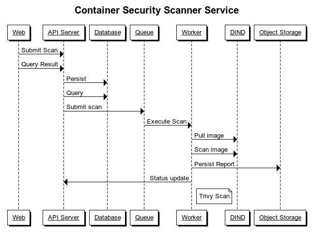

# Container Image Scanner API
A minimalist Go API to scan Docker images for security vulnerabilities and weaknesses

</img>

## TL;DR

Requirements:

* Docker
* Docker Compose
* Go 1.12+

Clone this repository

```
git clone https://github.com/abhisek/container-image-scanner-api && \
  cd container-image-scanner-api
```

Build the API server

```
make
```

Start services

```
docker-compose up
```

> The API server container mounts current directory for ease in development. You can re-build API server and restart the service: `docker-compose restart apisvr` without having the need to rebuild the entire API Server image.

Submit scan:

```
curl -d '{"image": "ubuntu"}' http://localhost:8000/scans
```

Get scan status

```
curl http://localhost:8000/scans/:scan_id/status
```

Get scan report

```
curl http://localhost:8000/scans/:scan_id
```

## Docker in Docker

The application uses `docker:dind` (Docker in Docker) for pulling image and scanning with external tools (currently only [Trivy](https://github.com/aquasecurity/trivy)). This model is to ensure we can run this safely in [Kubernetes](https://kubernetes.io/) and avoid any dependency or clutter in host system.

Two containers are used to deliver the service:

1. Docker in Docker (DIND) container
2. API Server (This app) container

`/var/run` is shared between the two containers to allow `API Server` access to `DIND` through unix socket in `/var/run/docker.sock`

## Current Architecture

In memory data structure with [go-routine](https://tour.golang.org/concurrency/1) based asynchronous tasks. Check [service.go](https://github.com/abhisek/container-image-scanner-api/blob/master/service.go) for more details.

> Redis is used for persistence with *15 minutes* expiration for reports

## Proposed Architecture



> The current version do not use persistence

